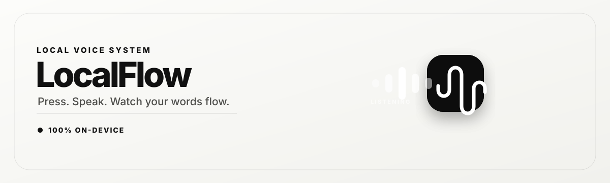

<div align="center">



<br/>

**Press a key. Speak. Watch your words appear — typed straight into any app.**
_100% on your machine. No cloud. No account. No subscription._

<br/>


</div>

---

## 🎙️ What is LocalFlow?

LocalFlow is a **voice-to-text app that runs entirely on your own computer**. You press a
hotkey (or a mouse button), speak naturally, and your words are transcribed by
[OpenAI Whisper](https://github.com/ggerganov/whisper.cpp) running **locally** and typed
into whatever app you're using — your email, a chat, a doc, anything.

An **optional** local AI model (via [llama.cpp](https://github.com/ggerganov/llama.cpp))
can polish the text: remove "um / uh / like", fix punctuation, and even understand spoken
corrections like _"meet at 6pm, no wait, 8pm"_ → **"meet at 8pm"**.

> 🔒 **Nothing ever leaves your machine.** No internet connection is needed to dictate.
> Your voice and your words are never uploaded anywhere.

### ✨ Highlights

| | |
|---|---|
| 🔒 **Fully local & private** | Whisper + optional LLM run on-device. Zero cloud, zero telemetry. |
| ⌨️ **Trigger your way** | A keyboard hotkey, hold-to-talk, or a spare mouse button. |
| ✍️ **Types anywhere** | Text is injected right at your cursor in any app. |
| 🧠 **Smart cleanup** | Optional local AI removes filler and fixes punctuation. |
| 🗣️ **Voice commands** | Say "new line", "comma", "scratch that" — and self-corrections just work. |
| 🌗 **Beautiful UI** | Light/dark themes, live mic bubble, usage dashboard. |
| 🚀 **Launch at login** | Always ready in your menu bar / tray. |
| 🌐 **English + Hindi** | Including Hindi→Latin "Hinglish" romanization. |

---

## 🚀 Getting LocalFlow — pick your path

There are **two ways** to get LocalFlow. Never touched code before? **Option A** is for you.

### 🟢 Option A — Download the ready-made app (easiest, no coding)

> **Never used GitHub before? No problem — just follow these clicks.**

1. Go to the **[Releases page](https://github.com/aryabysani/LocalFlow-OSS/releases)**
   (also reachable from the **"Releases"** link on the right side of this page).
2. Under the newest release, open **"Assets"** and download the file for your computer:
   - **macOS** → the file ending in **`.dmg`**
   - **Windows** → the file ending in **`.exe`** (or `.msi`)
3. **Install it:**
   - **macOS:** double-click the `.dmg`, then drag the **LocalFlow** icon into your
     **Applications** folder.
   - **Windows:** double-click the `.exe` and follow the prompts.
4. **Open it for the first time:**
   - **macOS:** the app isn't code-signed yet, so macOS blocks it once. On
     **macOS 15 Sequoia and later**, open **System Settings → Privacy & Security**,
     scroll to the message naming LocalFlow, and click **Open Anyway**. On
     **macOS 14 and earlier**, right-click the app → **Open** → **Open**. You only do
     this once — see [MAC_INSTALL.md](./MAC_INSTALL.md) for the full walkthrough.
   - **Windows:** if a blue **"Windows protected your PC"** box appears, click
     **More info** → **Run anyway** (this happens because the app is new/unsigned).
5. **Grant permissions** when the setup wizard asks (see [Permissions](#-permissions) below).
   That's it — press your hotkey and start talking!

> ⚠️ **No releases listed yet?** This project may be brand new. Use **Option B** below to
> build it yourself — it's only a few commands.

### 🔵 Option B — Build it yourself (all copy-paste, beginner-friendly)

"Building" just means turning the source code into a real app. **You don't need to
understand any of it** — you copy a command, paste it into your terminal, press **Enter**,
and wait for it to finish before pasting the next one.

> **First, open your terminal:**
> - **macOS** → open the **Terminal** app (find it with Spotlight: press `⌘ + Space`, type "Terminal").
> - **Windows** → open **PowerShell** (click Start, type "PowerShell").
>
> Then just paste the commands below **one line at a time**, top to bottom.

<details open>
<summary><b>Step 1 — Install the free tools (one time only) — 🍎 macOS</b></summary>

<br/>

Paste these **one at a time**. Some will ask for your Mac password (the text stays
invisible while you type — that's normal, just type it and press Enter) or ask you to
press **Enter** / **Y** to continue.

```bash
# 1) Install Homebrew — the "installer" for developer tools. (Skip if you already have it.)
/bin/bash -c "$(curl -fsSL https://raw.githubusercontent.com/Homebrew/install/HEAD/install.sh)"
```
```bash
# 2) Let this terminal find Homebrew (needed on Apple-Silicon Macs)
echo 'eval "$(/opt/homebrew/bin/brew shellenv)"' >> ~/.zprofile && eval "$(/opt/homebrew/bin/brew shellenv)"
```
```bash
# 3) Install Node.js, the pnpm helper, and Apple's build tools
brew install node pnpm
xcode-select --install
```
```bash
# 4) Install Rust — when it asks, just press Enter to accept the default (option 1)
curl --proto '=https' --tlsv1.2 -sSf https://sh.rustup.rs | sh
```
```bash
# 5) Switch Rust on in this terminal
source "$HOME/.cargo/env"
```

</details>

<details>
<summary><b>Step 1 — Install the free tools (one time only) — 🪟 Windows</b></summary>

<br/>

Paste these into **PowerShell** one at a time. If Windows asks for permission, say **Yes**.

```powershell
# 1) Install Node.js (LTS) and Rust
winget install OpenJS.NodeJS.LTS
winget install Rustlang.Rustup
```
```powershell
# 2) Install the pnpm helper the app uses
npm install -g pnpm
```
```powershell
# 3) Install the C++ build tools Rust needs (this one takes a few minutes)
winget install Microsoft.VisualStudio.2022.BuildTools --override "--add Microsoft.VisualStudio.Workload.VCTools --includeRecommended"
```

Then **close PowerShell and open it again** so the new tools are picked up.
(WebView2 is already built into Windows 11 — nothing to do.)

</details>

<details open>
<summary><b>Step 2 — Download the code</b></summary>

<br/>

Paste these two lines:

```bash
git clone https://github.com/aryabysani/LocalFlow-OSS.git
cd LocalFlow-OSS
```

> **Prefer clicking instead of Git?** Scroll to the top of this page → green
> **`< > Code`** button → **Download ZIP** → double-click to unzip. Then in your terminal
> type `cd ` (with a space after it) and **drag the unzipped folder onto the terminal
> window** — it pastes the path for you — and press **Enter**.

</details>

<details open>
<summary><b>Step 3 — Build &amp; run it</b></summary>

<br/>

```bash
# Download the app's building blocks (takes a minute or two)
pnpm install
```

Now pick **one** of these:

```bash
# A) Just try it right now — opens the app in test mode
pnpm tauri dev
```
```bash
# B) Make a real, installable app you can keep and share
pnpm tauri build
```

> ☕ The **first** `pnpm tauri build` compiles a lot of AI code and can take
> **10–20 minutes**. Later builds are much faster.

</details>

**Where the finished app appears** (after `pnpm tauri build`):

| Your computer | Look here for the app |
|----|----------|
| **macOS** | `src-tauri/target/release/bundle/dmg/` → the **`.dmg`** (or the `.app` in `.../bundle/macos/`) |
| **Windows** | `src-tauri\target\release\bundle\nsis\` → the **`.exe`** (or the `.msi` in `.../bundle/msi/`) |

Open that file to install, then grant permissions on first launch (see
[Permissions](#-permissions) below).

---

## 🔐 Permissions

On first run, LocalFlow's setup wizard asks for a few permissions. They're required for it
to actually hear you and type for you — and because everything is local, **these grants
stay on your machine**.

| Permission | Why it's needed | Platform |
|------------|-----------------|----------|
| 🎤 **Microphone** | To hear your voice and transcribe it | macOS & Windows |
| ♿ **Accessibility** | To type the text into other apps | macOS |
| 🖱️ **Input Monitoring** | _Optional_ — only if you use a **mouse button** as a trigger | macOS |

On macOS the app does nothing until Microphone **and** Accessibility are granted — the
wizard links you straight to the right settings pane. Full walkthrough:
**[MAC_INSTALL.md](./MAC_INSTALL.md)**.

---

## 🧠 How it works

```
   ⌨️ Hotkey / 🖱️ mouse ─▶ 🎤 record ─▶ 🧠 Whisper (local) ─▶ ✍️ cleanup ─▶ ⌨️ typed into your app
                                                              (optional local LLM)
```

1. A global **hotkey or mouse button** toggles recording.
2. Your mic is captured and transcribed by **Whisper**, fully offline.
3. Text is cleaned up — filler removed, punctuation fixed, and **spoken self-corrections
   resolved** (optionally with a local LLM). See the design notes in
   [docs/self-correction.md](./docs/self-correction.md).
4. The result is **typed into whatever app is focused**, and saved to your local history.

### 🗣️ Voice commands cheat-sheet

| Say this… | …and you get |
|-----------|--------------|
| "new line" / "new paragraph" | a line break |
| "comma" / "period" / "question mark" | `,` `.` `?` |
| "meet at 6pm **no wait** at 8pm" | "meet at 8pm" |
| "send it to Bob**, sorry,** to Jim" | "send it to Jim" |
| "let's meet at five **scratch that** at six" | "let's meet at six" |

---

## 🛠️ Tech stack

- **[Tauri 2](https://tauri.app/)** — lightweight desktop shell (Rust backend + web UI)
- **Rust** — audio capture, Whisper/LLM orchestration, global hooks, text injection
- **React 19 + TypeScript + Vite** — the settings window & floating mic bubble
- **[whisper.cpp](https://github.com/ggerganov/whisper.cpp)** — local speech-to-text
- **[llama.cpp](https://github.com/ggerganov/llama.cpp)** — optional local text cleanup

---

## 🤝 Contributing

Contributions are welcome — especially bug reports with real reproduction steps.

- **[CONTRIBUTING.md](./CONTRIBUTING.md)** — dev setup, project layout, how to run the checks
- **[Report a bug](https://github.com/aryabysani/LocalFlow-OSS/issues/new?template=bug_report.yml)**
  or **[request a feature](https://github.com/aryabysani/LocalFlow-OSS/issues/new?template=feature_request.yml)**
- **[CHANGELOG.md](./CHANGELOG.md)** — what changed in each release
- **[CODE_OF_CONDUCT.md](./CODE_OF_CONDUCT.md)** — be decent to people
- **[SECURITY.md](./SECURITY.md)** — report vulnerabilities privately, not as an issue

One hard rule: LocalFlow runs **entirely on-device**. Any change that sends audio, text,
or usage data over the network will be declined, however useful it is.

---

## 📜 License

Released under the **[MIT License](./LICENSE)** — free to use, modify, and distribute.

## 💚 Credits

Built on the incredible open-source work of **whisper.cpp**, **llama.cpp**, and **Tauri**.
Whisper and LLM models are downloaded from their respective open model repositories and run
entirely on your device.

<div align="center">
<br/>
<sub><b>LocalFlow</b> · your voice, on your machine.</sub>
</div>
